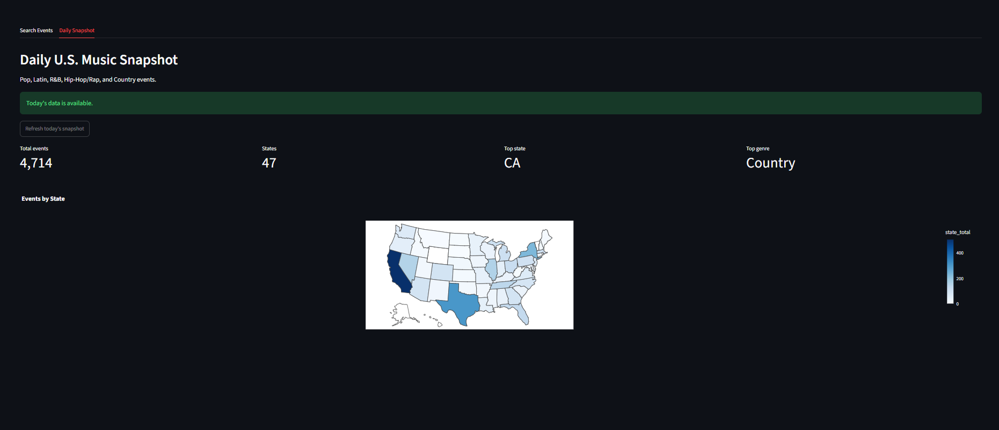

# Ticketmaster Global Events Analysis

A streamlit app for exploring live music events from ticketmaster. It searches US events by city, genre, date or view a daily snapshot of events by state and genre.

**Live app:** https://ticketmaster-global-events-gsqwgc5oxusilha9vj82xa.streamlit.app/



## Python Version

Python 3.10

## Local Environment
### Environment Variables
From the root of your project, run the following to create your .env file with the required variables:

```bash
cp .env.example .env
```

You will need to replace those key values with API keys retrieved from the [Ticketmaster API](https://developer.ticketmaster.com/products-and-docs/apis/getting-started/) and from Duke's [AI Gateway](https://dashboard.ai.duke.edu/api-keys).

### Install dependencies
Create your virtual environment with

```bash
python3 -m venv .venv
source .venv/bin/activate
```

Once your virtual environment is activated, install the required dependencies:

```bash
pip install -r requirements.txt
```


## Data Processing
The dataframe processing is handled in `dataframe_utils.py`.

It:
- filters the data to U.S. events and the five selected music genres
- groups events by date, state, and genre
- supports filtering by a selected date range
- calculates state and genre totals and percentages
- creates a state summary table for visualization

`preview_data.py` can be used to quickly check the processed data and summary tables.

## How to run the webapp

```bash
streamlit run streamlit-app.py
```

## How to run the CLI

```bash
streamlit run cli_demo.py
```

This fetches todays events and saves them. It skips the download if todays file already exists.


## Additional Github Information
Users ishikabhatia26 and ishikabhatia12 are tied together.